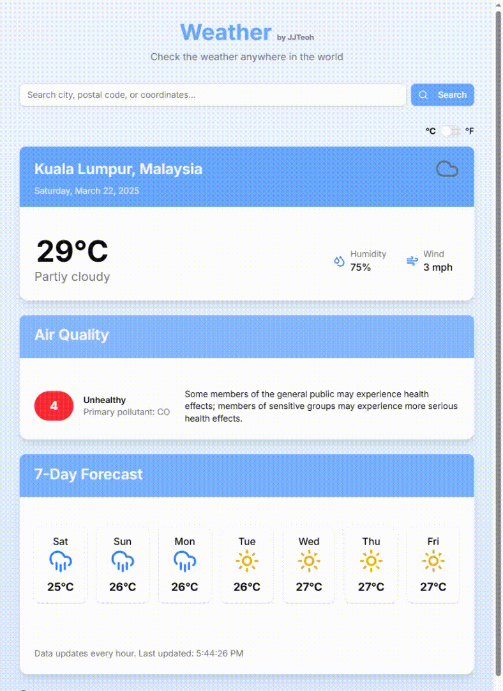
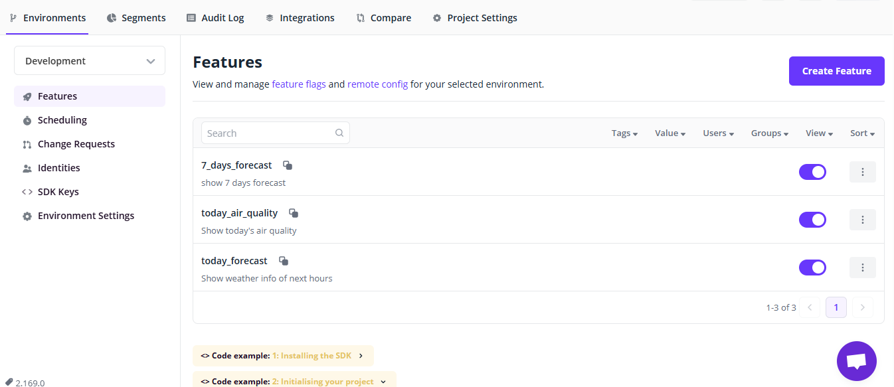

# Next.js Progressive Weather App

A modern, responsive weather application built with Next.js that works online and offline.

## Preview

<!--  -->
<div align="center">
   
</div>


<div align="center">

### [Browse Live App](https://next-pwa-weather.vercel.app/)

</div>

## Features

- 🌦️ **Real-time Weather Data**: Get up-to-date weather information from a public weather API
- 📱 **Progressive Web App**: Works offline with cached data
- 🔍 **Location Search**: Find weather for any location worldwide
- 📅 **7-Day Forecast**: View weather predictions up to 7 days 
- 🌡️ **Temperature Units**: Toggle between Celsius and Fahrenheit
- 💨 **Air Quality Information**: Detailed air quality metrics including index, level, and primary pollutant
- 🖥️ **Responsive Design**: Optimized for mobile, tablet, and desktop
- 💾 **Installable**: Can be installed on devices as a standalone app
- 🌎 **Geolocation Support**: Use current location as default location
- 🚩 **Feature Flag**: Integrated with [FlagSmith](flagsmith)

## Tech Stack

- Next.js 14
- TypeScript
- TailwindCSS
- shadcn/ui components
- Service Workers for offline functionality
- WeatherAPI.com for weather data
- Geolocation support for precise weather info
- FlagSmith - feature flag to enable/disable features

Flagsmith cloud-based dashboard:

<div align="center">
   
</div>

## Getting Started

### Prerequisites

- Node.js 18+ and npm/yarn
- A WeatherAPI.com API key (free tier available)

### Installation

1. Clone the repository:
   ```bash
   git clone https://github.com/your-username/next-pwa-weather.git
   cd next-pwa-weather
   ```

2. Install dependencies:
   ```bash
   npm install
   ```

3. Create a `.env.local` file in the root directory:
   ```
   WEATHER_API_URL=https://api.weatherapi.com/v1
   WEATHER_API_KEY=YOUR_WEATHERAPI_KEY

   NEXT_PUBLIC_FLAGSMITH_KEY=YOUR_ENVIRONMENT_KEY
   ```

4. Start the development server:
   ```bash
   npm run dev
   ```

5. Open [http://localhost:3000](http://localhost:3000) in your browser.

## Usage

- **Search for a location**: Use the search bar to find any city worldwide
- **Toggle temperature units**: Switch between Celsius and Fahrenheit using the toggle in the header
- **View detailed weather**: See current conditions, humidity, wind speed, and air quality index
- **Check forecast**: Scroll down to see the 7-day forecast
- **Install the app**: Click the "Install App" button to add as a standalone application. For mobile only.

## Offline Functionality

The app caches weather data for your last viewed location. When offline:
- You'll see a notification that you're viewing cached data
- You can still access previously loaded weather information
- New location searches will be unavailable until you're back online

## License

[MIT](LICENSE)

## Acknowledgements

- Weather data provided by [WeatherAPI.com](https://www.weatherapi.com/)
- Icons from [Lucide Icons](https://lucide.dev/)
- UI components from [shadcn/ui](https://ui.shadcn.com/)
